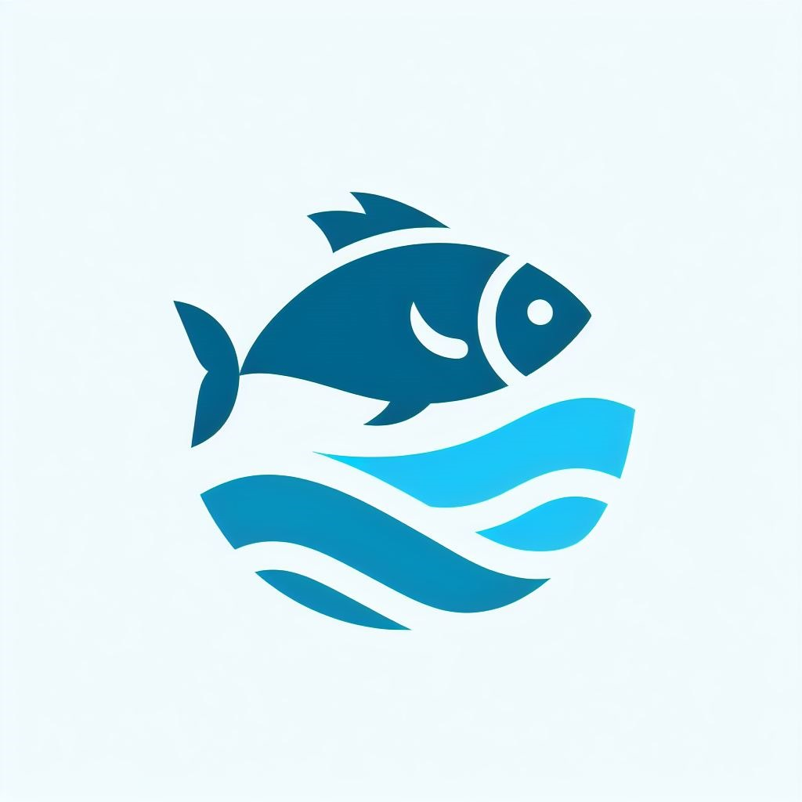

<h1 align="center">
  </img>
 
SeaFest
</h1>

<h1>Cloud Computing Path<h1>
# Profile

### Team ID : CH2-PS436

### Cloud Computing Members

* C014BSY4014 - [I Gede Surya Mahardika](https://www.linkedin.com/in/i-gede-surya-mahardika-784a7021a/)

<h2>Services</h2>
Fully use Google Cloud Platform (GCP)
  <li>Firebase</li>
  <li>Cloun Run, Cloud Storage, and Cloude Storage</li>
  <li>APIs and Services</li>

<h2>Implementation</h2>
  <li>Provide Firebase Services (Firebase Authentication) to store users account.</li>
  <li>Build a REST API location and make an endpoint of it.</li>
  <li>Create a bucket in gloud storage to store fish images and profile photos.</li>
  <li>Create a database in firebase to store data (fish and users).</li>
  <li>Deploy the API on Cloud Run to make it accessible.</li>
  <li>Provide APIs and Services (Features Application).</li>
  
  <h3>Firebase Authentication</h3>
  

  Sign-In Providers:
    <li>Email/Password</li>
  

  <h3>Documentation</h3>
  <li>API Documentation : https://documenter.getpostman.com/view/30041947/2s9YkrZenZ</li>
  
  <h3>API Location</h3>
  

    Steps:
  <li>Build a REST API using Node.js</li>
    Method : GET and Post 
    Auth Required : NO  
    No Data Must Provided 

  <li>Deploy on Cloud Run</li>
    Endpoint : https://capstonefish-yz6ahwzkra-et.a.run.app
  
